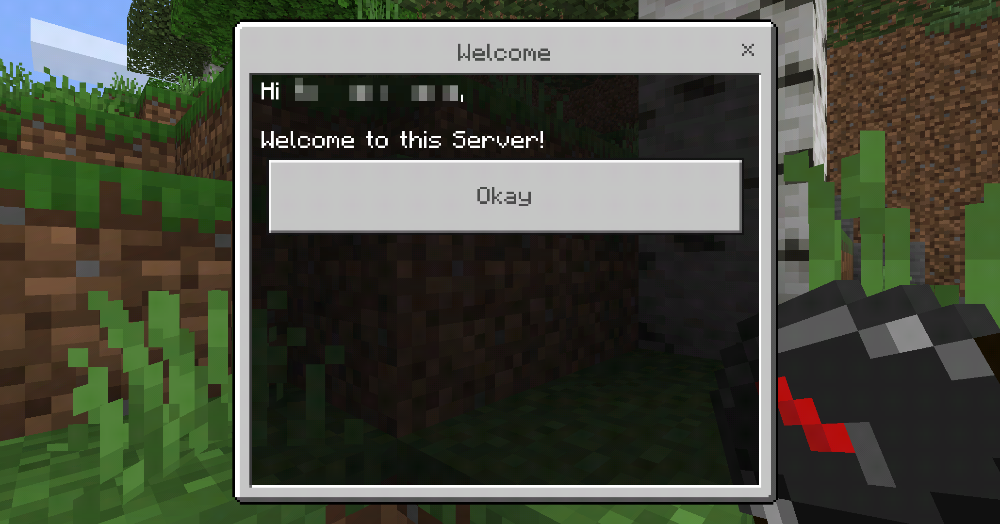
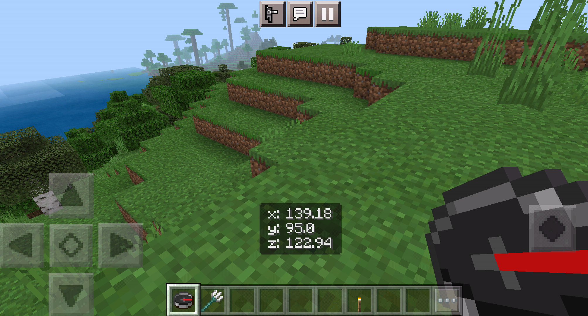

## Nukkit Plugin welcomes the player!

### What does this plugin do?

1. It welcomes you with an customizable welcome window!
   
2. You are able to get your current coordinates by using a compass
   Necessary because Bedrock edition doesn't have this possibility otherwise
   (who tf knows why)
   

### How to install

1. Download the release or a build artifact package
2. Move the my-plugin-VERSION.jar into the `plugins` folder
3. Start the server! While starting and activating the plugin it will create a folder named `MyPlugin`
4. In that folder you could find the `config.yml` for configuring the window etc.